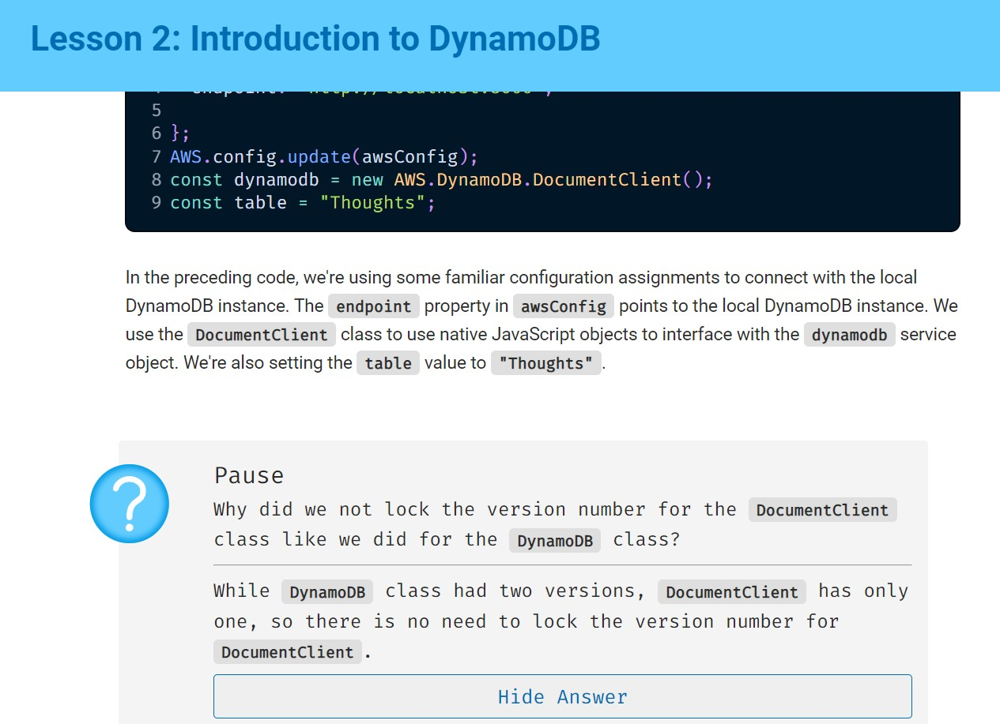
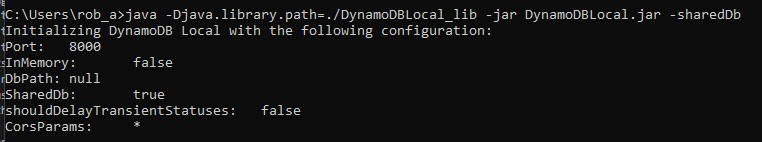
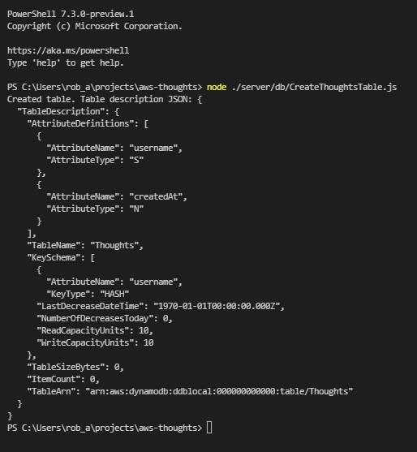
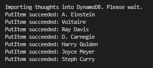
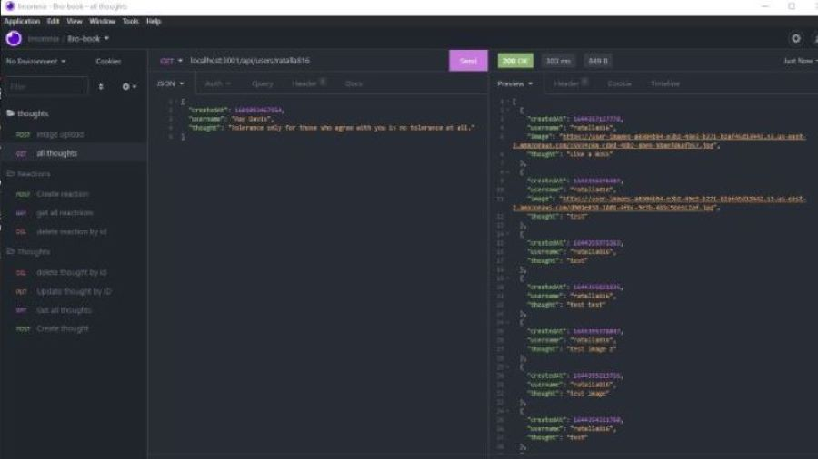

# AWS Integration: Deep Thoughts

  
    
  
   
  
   
  
   
  
   
  
  
  ## Description
  
   The Deep Thoughts application which allows users to post their thoughts, was built using React, Node.js, Express.js, and MongoDB, which makes it a MERN application. 
   Moving forward, we'll deploy this app to the cloud and replace the back-end API with cloud resources to handle the storage, database, and computing.

   We've chosen Amazon Web Services, or AWS, to fulfill this role. We chose AWS over other providers, like Microsoft Azure or the Google Cloud Platform, because AWS is currently the most comprehensive and widely adopted cloud platform. 
   AWS offers the widest range of web services, a vast array of customers (from startups to enterprise), and an extensive free tier.

   Upon completing this project, we will learn how to do the following:

   * Configure IAM user permissions to connect various AWS services.

   * Store and retrieve static assets using Amazon Simple Storage Service (S3).

   * Connect an existing application to a DynamoDB database.

   * Configure a Linux server to deploy the application to an Elastic Compute Cloud (EC2) instance.
 
  ## Table of Contents
  - [Description](#description)
  - [Documentation](#documentation)
  - [Usage](#usage)
  - [Screenshot](#screenshot)
  - [Features](#features)
  - [Acknowledgements](#acknowledgements)
  - [License](#license)
  - [Abstract](#abstract)
  - [Testing](#testing)
  - [Contact](#contact)

  ## Documentation
  
  * <a href="https://aws.amazon.com">AWS</a> 
  * <a href="https://aws.amazon.com/iam">IAM (Identity and Access Management)</a>
  * <a href="https://aws.amazon.com/s3">S3 (Simple Storage Service)</a>
  * <a href="https://aws.amazon.com/dynamodb">DynamoDB (Database)</a> 
  * <a href="https://aws.amazon.com/blogs/database/choosing-the-right-dynamodb-partition-key/#:~:text=DynamoDB%20stores%20data%20as%20groups,value%2C%20which%20must%20be%20unique.&text=DynamoDB%20splits%20partitions%20by%20sort,grows%20bigger%20than%2010%20GB">AWS documentation on partition keys for DynamoDB</a> 
  * <a href="https://aws.amazon.com/ec2">EC2 (Elastic Compute Cloud)</a>
  * <a href="https://aws.amazon.com/ecs">ECS (Elastic Container Service)</a>
  * <a href="https://aws.amazon.com/cli">Amazon Command Line Interface (CLI)</a>
  * <a href="https://aws.amazon.com/lambda">Lambda (Lambda Functions)</a>
  * <a href="https://aws.amazon.com/cloudfront">CloudFront (Content Delivery Network)</a>
  * <a href="https://aws.amazon.com/cloudwatch">CloudWatch (Monitoring)</a>
  * <a href="https://www.npmjs.com/package/aws-sdk">AWS-SDK (official AWS software development kit (SDK) for JavaScript)
  * <a href="https://www.npmjs.com/package/multer">Multer (Node.js middleware for handling file uploads)</a>
  * <a href="https://www.npmjs.com/package/uuid">UUID Universally Unique Identifier - generates random alphanumeric strings that can serve as unique identifiers. (generate identifiers for S3 bucket and application images)</a>
  * <a href="https://www.npmjs.com/package/pm2">Node.js production process manager that helps you manage your web application—and keep it live online.</a>
  * <a href="https://www.nginx.com">Nginx (free and open-source web server that can also serve as a reverse proxy, load balancer, mail proxy, or HTTP cache)</a>
  * <a href="https://dynobase.dev/run-dynamodb-locally/#connecting-dynamodb-offline-sdk">How to run DynamoDB Local and Offline - Complete Guide</a>
  
  * Left off here: <https://coding-boot-camp.github.io/continuation-courses/aws/lesson-3-integrate-db> 
  SEE ISSUE #6 FOR MORE INFORMATION
  <!--   -->
 
  ## Usage

  * As a developer, I want to be able to view the management console in AWS.
  * As a developer, I want to manage my IAM role.
  * As a developer, I want to set up a billing alert.
  * As a developer, I need to create a route to query all the thoughts.
  * As a developer, I need to create a route to query all the thoughts from a user.
  * As a developer, I need to create a route to create a thought.
  * As a user, I want to view all the thoughts.
  * As a user, I want to be able to create a new thought.
  * As a user, I want to view thoughts of a user.
  * As a user, I want to add an image to my thought.
  * As a user, I want to see all images.
  * As a user, I want to view images of a user.
  * As a user, I want to be able to visit the app on a public URL.

  ### Instructions 
  * Install AWS-CLI on Windows <https://awscli.amazonaws.com/AWSCLIV2.msi> To verify the installation, open the Start menu, search for cmd to open a command-prompt window, and at the command prompt use the aws --version command.
  
  * Use the aws-sdk package to interface with AWS from the Node.js application. Create a file the root directory called create-bucket.js and import the uuid package Download the NPM packages to the node_modules directory with the following command: npm install aws-sdk uuid Now run the create-bucket.js file at the command line from the root directory of the application, as follows: node create-bucket.js You should see a success message in the command line if you've successfully created a new S3 bucket.
  
  * Download the DynamoDB file and start a local instance of the database: 
  Visit the <a href="https://docs.aws.amazon.com/amazondynamodb/latest/developerguide/DynamoDBLocal.DownloadingAndRunning.html">AWS DynamoDB download page and select the zip file in the US region.</a> 
  Open the zip file to expand the folder. 
  Open the CLI, navigate to where this folder is located, and cd into that folder. 
  Run the following command: java -Djava.library.path=./DynamoDBLocal_lib -jar DynamoDBLocal.jar -sharedDb 
  NOTE! Windows 10 users might need to enclose parameter name or the name & value. Try running one of these paths instead: 
  java -D"java.library.path"=./DynamoDBLocal_lib -jar DynamoDBLocal.jar -sharedDb (this is what I use) 
  OR 
  java "-Djava.library.path=./DynamoDBLocal_lib" -jar DynamoDBLocal.jar -sharedDb
  Upon success you will should see a message similar to this:  
  
  * Create a table in ./server/db then run the following command: node ./server/db/(your-table-name).js 
  If the table was created successfully, we should see a message that resembles the following image:  
  
  * Run seeds by navigating to the root directory then execute this command: node ./server/db/LoadThoughts.js 
  If the seeds were created successfully, we should see a message that resembles the following image:  
  
  * Next

  ## Screenshot
  
  
  

  ## Features
  * DynamoDB With MongoDB and relational databases like MySQL, as the number of requests increase, the performance drops. DynamoDB, however, was made with high performance under extreme load conditions in mind. If we use a large-scale-first mentality when designing web applications, we can circumvent the technical debt of database migration by starting with a system that can handle a high request load.
  
  # Acknowledgements
  
  * Rob Atalla
    
  ## License
  
   
  Permission to use this application is granted under the MIT license. <https://opensource.org/licenses/MIT>

  ## Abstract
  
  ### Benefits of cloud computing
  
  Cloud computing is the on-demand availability of computer system resources through the internet, which enables companies to use remote data centers to serve applications on a pay-as-you-go basis.

  The cloud refers to servers that are accessed through the internet. For example, when you back up images on your phone to the cloud, the photos aren't stored on-premises (in other words, on your phone) but in a remote server connected via the internet. Many email services use the cloud too, allowing you to send and receive hundreds or even thousands of messages at any time. In this way, cloud storage serves as a reliable backup that preserves data even if you lose or break your device.

  With cloud computing, a company can instead focus on their core competencies and shift the administrative infrastructure and IT work onto a cloud provider. Managers don't have to worry about costly server failures anymore, because cloud providers replicate their code on redundant systems, guaranteeing to provide 99.999% uptime (Source: <a href="https://aws.amazon.com/blogs/publicsector/achieving-five-nines-cloud-justice-public-safety/#:~:text=The%20accepted%20availability%20standard%20for,system%20must%20work%20seamlessly%20together.">AWS/Amazon</a>)

  Another key advantage is that cloud computing leverages not just a single data center but a global infrastructure of data centers that can serve consumers at previously unthinkable speeds. Such a comprehensive network of data centers allows even a small company to serve performant applications globally.
  ### Deployment Models 

  certain industries like healthcare, finance, and government require more rigorous security measures because of the sensitive nature of the information they store. A breach of this type of data can lead to national security concerns or other serious problems. Advancements in technology have helped reduce the extent of data breaches, but security should remain a major concern for all cloud users.

  Adherence to security protocol is ultimately the best safeguard against data breaches, because most occur due to human error. That said, cloud computing offers different deployment models to accommodate varying security concerns, including private clouds, public clouds, and hybrid clouds:

  * When security is a top concern, a private cloud provides more security than a public cloud, but less than an on-premises server. The private cloud has specific access points that only certain devices or IP addresses can enter.

  * The public cloud, on the other hand, can be accessed from any device through any IP address.

  * And as you might imagine, a hybrid cloud combines features of public and private clouds—which is useful for organizations like a government agency that needs both high security to store private data and a public-facing interface for    the community.

  ### Service Models

  Cloud providers offer many types of computer resources, because the needs of applications are wide-ranging. Cloud providers also offer many levels of service depending on how much time, energy, and control is available. Let's explore a few.

  * Platform-as-a-Service (PaaS)
    Imagine that Company A does not have the extra personnel, time, or desire to configure their own cloud solution. They might have a very simple application that won't strain resources, so they would like a solution right out of the box. The best service model in this scenario would be a Platform-as-a-Service, or PaaS.

    Heroku is an example of a PaaS. When we want to deploy an app on Heroku, we don't need to specify computer system requirements; we simply connect the GitHub repo and optimize the build for deployment. PaaS models are built for developers that don't have an IT administrative background and just want to plug-and-play.

  * Software-as-a-Service (SaaS)
    SaaS, or Software-as-a-Service, is another popular service model. The difference between PaaS and Saas is that SaaS is for end users. In the PaaS model, the application is served to users through the cloud, which runs the application and stores the user's data, typically for a subscription fee. GitHub is an example of a SaaS, as many companies pay GitHub to secure their source code and use their tools. The repos are stored in the cloud, and the interface connects users to their accounts. Other popular SaaS companies include Zoom, Microsoft Office, Adobe, Salesforce, DoorDash, and Peloton. E-commerce sites are often not thought of as SaaS due to the difference in the business model and the exchange of hard goods.

    The meteoric rise and success of companies that use the SaaS business model illustrates the extent to which cloud computing is a powerful economic vehicle that can scale globally to reach millions of consumers and handle this load efficiently. The amazing profit margins that a SaaS company can attain demonstrates the economic feasibility of using cloud computing to deliver software solutions in a consistent and reliable manner.

  * Infrastructure as a Service (IaaS)
    IaaS, or Infrastructure as a Service, is another service model. The difference between PaaS and IaaS is that IaaS is for the infrastructure. In the PaaS model, the application is served to users through the cloud, which runs the application and stores the user's data, typically for a subscription fee. GitHub is an example of a IaaS, as many companies pay GitHub to secure their source code and use their tools. The repos are stored in the cloud, and the interface connects users to their accounts. Other popular IaaS companies include Zoom, Microsoft Office, Adobe, Salesforce, DoorDash, and Peloton. E-commerce sites are often not thought of as IaaS due to the difference in the business model and the exchange of hard goods.

    The meteoric rise and success of companies that use the IaaS business model illustrates the extent to which cloud computing is a powerful economic vehicle that can scale globally to reach millions of consumers and handle this load efficiently. The amazing profit margins that a IaaS company can attain demonstrates the economic feasibility of using cloud computing to deliver software solutions in a consistent and reliable manner.

  ## Testing
  Insomnia

  ## Contact:
  Holler at me! <a href="mailto:rob.atalla@robatalla816.com">rob.atalla@robatalla816.com</a>