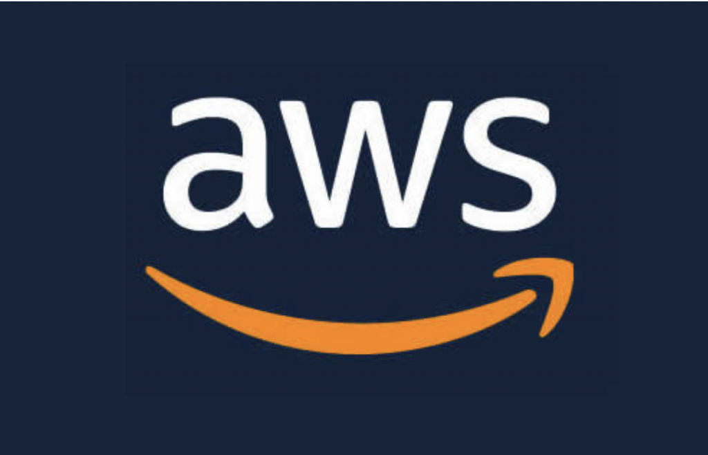

# AWS Integration: Deep Thoughts

  
    
  
   
  
   
  
   
  
   
  
  
  ## Description
  
   The Deep Thoughts application which allows users to post their thoughts, was built using React, Node.js, Express.js, and MongoDB, which makes it a MERN application. 
   Moving forward, we'll deploy this app to the cloud and replace the back-end API with cloud resources to handle the storage, database, and computing.

   We've chosen Amazon Web Services, or AWS, to fulfill this role. We chose AWS over other providers, like Microsoft Azure or the Google Cloud Platform, because AWS is currently the most comprehensive and widely adopted cloud platform. 
   AWS offers the widest range of web services, a vast array of customers (from startups to enterprise), and an extensive free tier.
 
  ## Table of Contents
  - [Description](#description)
  - [Documentation](#documentation)
  - [Usage](#usage)
  - [Screenshot](#screenshot)
  - [Features](#features)
  - [Acknowledgements](#acknowledgements)
  - [License](#license)
  - [Testing](#testing)
  - [Contact](#contact)

  ## Documentation
  
  * <https:///> - AWS Documentation
  * <https://> - TBD
  * Left off here: <https://coding-boot-camp.github.io/continuation-courses/aws/lesson-1-cloud-intro>
 
  ## Usage

  * As a developer, I want to be able to view the management console in AWS.
  * As a developer, I want to manage my IAM role.
  * As a developer, I want to set up a billing alert.
  * As a developer, I need to create a route to query all the thoughts.
  * As a developer, I need to create a route to query all the thoughts from a user.
  * As a developer, I need to create a route to create a thought.
  * As a user, I want to view all the thoughts.
  * As a user, I want to be able to create a new thought.
  * As a user, I want to view thoughts of a user.
  * As a user, I want to add an image to my thought.
  * As a user, I want to see all images.
  * As a user, I want to view images of a user.
  * As a user, I want to be able to visit the app on a public URL.

  ### Instructions 
  *
  * 
  * 

  ## Screenshot
  

  ## Features
  TBD
  
  # Acknowledgements
  
  * Rob Atalla
    
  ## License
  
   
  Permission to use this application is granted under the MIT license. <https://opensource.org/licenses/MIT>

  ## Testing
  TBD

  ## Contact:
  Holler at me! <a href="mailto:rob.atalla@robatalla816.com">rob.atalla@robatalla816.com</a>